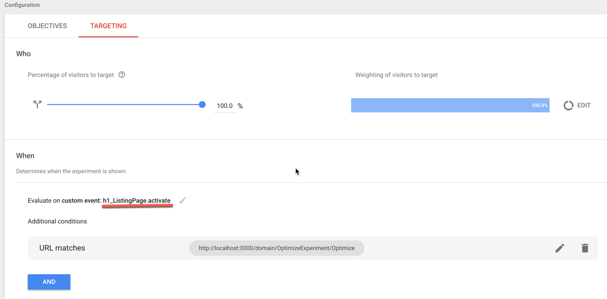
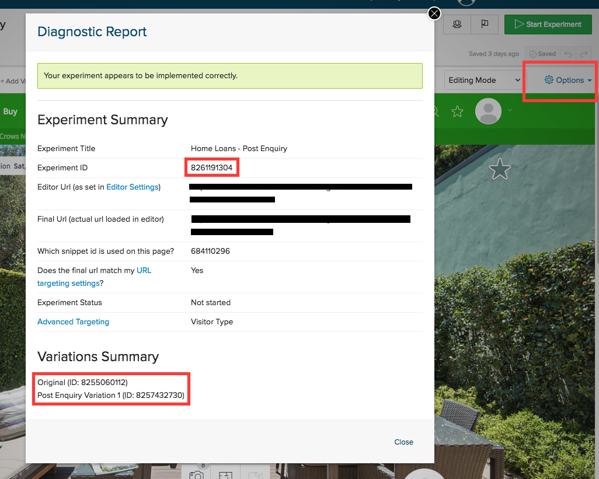

# react-experimentify
Experiments with React

## Usage

```bash
yarn add react-experimentify
```

### Optimize

1. Decide on an experiment name

* Guide `<Component under experiment>_<Placement Identifier>`

  * eg: `h1_ListingPage`

2. Set up an experiment in Google Optimize

* Code to execute via Google Optimize

  ```javascript
  window.dispatchEvent(new CustomEvent('h1_ListingPage.render', {
    detail: {
      title: 'Treatment - ' + Date.now()
    }
  }));
  ```
* Add `h1_ListingPage.activate` as custom event

  

3. Import

```javascript
  import React from 'react';
  import ReactDOM from 'react-dom';

  import { Experiment, Treatment, Control, Optimize, ExperimentOpacifier } from 'react-experimentify';
```

4. Initialization

```javascript
import { Experiment, Treatment, Control, Optimize, ExperimentOpacifier } from 'react-experimentify';
import React from 'react';
import ReactDOM from 'react-dom';

const experiment = new Optimize('h1_ListingPage');
```

5. Activation

* Experiment can be activated at any point in time after component has been mounted. We can activate it on the
client side as well. If we want the experiment to be activated straight after the parent component is mounted,
add following

```javascript
componentDidMount() {
  this.experiment.activate();
  this.unsubscribe = this.experiment.subscribe(state => this.setState(state));
}

componentWillUnmount() {
  this.unsubscribe();
}
```

6. Add following to render method. _(Here we are experimenting _h1_ tag)_

```javascript
  <Experiment experiment={experiment}>
    <div>
      <Treatment>
        <h1>Treatment 1</h1>
      </Treatment>
      <Control>
        <p>Control</p>
      </Control>
    </div>
  </Experiment>
```

7. With `ExperimentOpacifier`

* Helps to reduce the flickering effect when the experiment is loading.
* How it works?

  * Let the component under experiment to render the control version in transparent mode.
  * Wait for the experiment to kick in within the `timeout` period.
  * If the experiment loads before timing out, user will see the variant of the experiment.
  * If timed out, user will see control version.

  ```javascript
    <Experiment experiment={experiment}>
      <ExperimentOpacifier
        wrapper={'div'}
        timeout={250}
        transition={250}
      >
        <div>
          <Treatment>
            <h1>Treatment 1</h1>
          </Treatment>
          <Control>
            <p>Control</p>
          </Control>
        </div>
      </ExperimentOpacifier>
    </Experiment>
  ```

8. Override opacity behaviour

Because the `ExperimentOpacifier` initially renders with an opacity of `0`,
this be override with the `.experiment__opacity` class.

Add a `<noscript>` element to the page to override the opacity

```html
<noscript>
  <style>
    .experiment__opacity {
      opacity: 1 !important;
    }
  </style>
</noscript>
```

### Testing

This repo makes use of React's Context API, and as of July 2018, there is an issue with testing
components with Enzyme. See below for references:

* [Enzyme - New React context API adds new tag types](https://github.com/airbnb/enzyme/issues/1509)
* [Add support for react context element types](https://github.com/airbnb/enzyme/pull/1513#issuecomment-397128309)

To fix this issue, you can add a specific version of `enzyme-adapter-react-16` to your project depedencies:

```bash
yarn add --dev enzyme-adapter-react-16@npm:enzyme-react-adapter-future
```

And then, in your tests, configure Enzyme to use the adapter like so:

```javascript
import Adapter from 'enzyme-adapter-react-16';

enzyme.configure({ adapter: new Adapter() });
```

### Optimizely

```javascript
import { Experiment, Treatment, Control, optimizely } from 'react-experimentify';
import React from 'react';
import ReactDOM from 'react-dom';

const experiment = optimizely(experimentId, {
  '2': {
    content: 'Treatment 2'
  },
  '3': {
    content: 'Treatment 3',
  },
});

ReactDOM.render((
  <Experiment experiment={experiment}>
    <div>
      <Treatment groups={['1']}>
        <h1>Treatment 1</h1>
      </Treatment>
      <Treatment groups={[2, 3]}>
        {
          ({ content }) => (<h2>{content}</h2>)
        }
      </Treatment>
      <Control group={4}>
        <p>Control</p>
      </Control>
    </div>
  </Experiment>
), document.querySelector('.react-experimentify-entry-point'));
```

### Props

#### `Experiment`

| Prop | Type | Default | Description | Required |
| ---- | ---- | ------- | ----------- | -------- |
| children | `node` |  | A single child element to render | No |
| experiment | `object` |  | An experiment object used to run the experiment | Yes |

#### `Treatment`

| Prop | Type | Default | Description | Required |
| ---- | ---- | ------- | ----------- | -------- |
| children | `oneOf(node, func)` |  | The child elements or function to render the treatment | No |
| render | `func` |  | The function to render the treatment | No |
| groups | `oneOf(string, arrayOf(string))` |  | The groups that will receive the treatment | Yes |

_Note: You should not use `<Control render>` and `<Control children>` in the same control;
`<Control children>` will be ignored_

#### `Control`

| Prop | Type | Default | Description | Required |
| ---- | ---- | ------- | ----------- | -------- |
| children | `oneOf(node, func)` |  | The child elements or function to render the control | No |
| render | `func` |  | The function to render the control | No |
| group | `string` |  | The control group | Yes |

_Note: You should not use `<Treatement render>` and `<Treatement children>` in the same treatment;
`<Treatement children>` will be ignored_

#### `withExperiment(component: ReactElement)`

A higher order component that injects the current experiment as a prop to the wrapped component

#### `new Optimizely(experimentId: String[, groupVariants: Object])`

An experiment object for the Optimizely A/B testing platform

`experimentId`: the id for the current optimizely experiment

`groupVariants`: an optional map of variantIds to props. Used when rendering a `Treatement` for a given group

To setup an experiment in optimizely, create an experiment and add the required number of variants.
You need to decide which variants will be the Treatments and which will be the Control.

The `experimentId` and `variantId` can be found visiting the edit page for the experiment
and opening the 'Diagnostic Report' under options.



##### `Optimizely.pushEvent(eventName: String): void`

Pushes events to optimizely for tracking.

##### `optimizely.active(): void`

Manually activates an experiment.
Dispatches changes to all subscribers.

##### `optimizely.hasVariant([variantIds: Array[String]]): Boolean`

Determines if any of the variants are active for the current experiment.

##### `optimizely.isActive(): Boolean`

Determines if the current experiment is active.

##### `optimizely.isControl(): Boolean`

Determines if the current user is in the control group and no variants are active.

##### `optimizely.subscribe(listener: Function): Function`

Subscribe listener functions to changes to the experiment.
Returns the unsubscribe function.

##### `optimizely.update([{ group: String|Array[String]}]): void`

Updates the current experiment by moving the current user into a different treatment group.
Dispatches changes to all subscribers.
An empty `Array` will move the current user into the control group.

##### `optimizely.variantProps(): Object`

Gets the props for the current variant from the groupVariants.

## About This Project

### Features

A set of components to build experiments in React for A/B and Multivariate testing.

Using an experiment object, an `Experiment` component can be used to render `Treatment` and `Control` components.

_Note: Experiments should only ever be used in isolation on `fe-pa` or top level `fe-co` components.
Experiments should not be run across multiple consumers._

## Code Architecture

Check out the [`fe-boilerplate-generator@3.7.0`
docs](https://github.com/domain-group/fe-boilerplate-generator/tree/v3.7.0#code-architecture)
for info on the repo layout, structure and meaning.

## Changes and history

See [CHANGELOG.md](./CHANGELOG.md).
